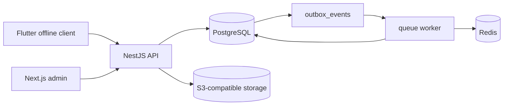
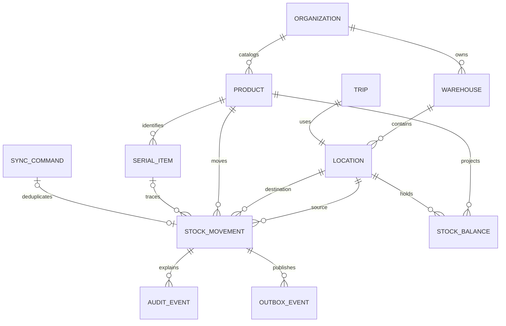

# Architecture

The system is a modular monolith for the MVP: NestJS modules share one PostgreSQL transaction
boundary while exposing an OpenAPI-first REST contract. This keeps stock correctness local and
allows later extraction through the outbox without premature distributed transactions.

## Domain model

## Modules

- Identity: user, role, permission, device, organization and warehouse scope.
- Catalog: product, barcode alias, components, serial policy and compatibility.
- Inventory: immutable movements, atomic balance projection, correction/reversal and rebuild.
- Scan: universal barcode/serial resolution.
- Sync: idempotent mobile commands with payload hashes and stable responses.
- Audit/outbox: append-only actor evidence and reliable integration events.
- Trip foundation: trip virtual locations and versioned manifests; workflows arrive in Phase 3.

## Transaction contract

A command locks affected balance and serial records, validates the invariant, inserts exactly one
movement, updates the balance projection, appends audit/outbox rows, and stores the stable sync
result in one database transaction. An idempotency key collision with a different canonical payload
is rejected. Failed transactions publish nothing.

Locations at an external inventory boundary, currently suppliers and return-to-vendor endpoints,
set `tracks_balance=false`. They remain explicit movement endpoints for traceability, but are omitted
from the internal non-negative balance projection. This permits the first inbound receipt without
inventing supplier-owned stock inside the warehouse ledger.

The API now enforces signed, 15-minute access tokens, permission claims, and warehouse scope before
calling the PostgreSQL ledger. Refresh credentials are opaque random values; only SHA-256 hashes are
stored, with a session family available for rotation/reuse revocation.

## Migration plan

1. Install PostgreSQL extensions and enum types.
2. Create tenancy, identity, warehouse and catalog tables.
3. Create immutable ledger, projection, sync, audit and outbox tables plus indexes/triggers.
4. Create workflow baseline tables so later phases are additive.
5. Seed reason codes and a deterministic demo organization in a separate idempotent seed command.
6. On every deployment: backup, migrate, rebuild projection in shadow tables, compare, then switch.

See `docs/adr/` for the binding architecture decisions.
